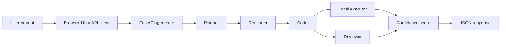

# Multi-Agent AI Code IDE

An experimental, local-first coding assistant that coordinates multiple AI agents to plan, reason about, generate, execute, and review code.

The project exposes a FastAPI API and includes a lightweight browser interface. It connects to an OpenAI-compatible chat-completions endpoint, making it suitable for use with a locally hosted model server.

> [!WARNING]
> The code runner is **not a hardened security sandbox**. Generated programs run as local subprocesses with your user account's permissions. Use trusted prompts and run the project only in a disposable or isolated environment.

## Features

- Multi-stage planner, reasoner, coder, and reviewer workflow
- FastAPI endpoint for code-generation requests
- Browser-based interface with syntax highlighting and one-click copy
- Python, C++, Java, and JavaScript generation and execution
- Captured standard output, standard error, exit code, and executed source
- Five-second compile and execution timeout
- Heuristic confidence score based on execution and review feedback
- Experimental mathematical reasoning pipeline with voting and SymPy verification

## How it works



The default pipeline is implemented in `orchestrator_code.py` and returns the plan, reasoning, generated code, execution result, review, and confidence score.

## Tech stack

- Python 3.10+
- FastAPI and Pydantic
- Requests
- Plain HTML, CSS, and JavaScript
- Prism.js for browser syntax highlighting
- SymPy for the experimental mathematical verification path

## Prerequisites

Install the following before starting:

- Python 3.10 or newer
- An OpenAI-compatible LLM server with a model loaded
- One or more optional language toolchains:

| Language | Required command |
| --- | --- |
| Python | Included with the active Python environment |
| C++ | `g++` |
| Java | `javac` and `java` |
| JavaScript | `node` |

The browser UI loads Prism.js from jsDelivr, so syntax highlighting requires an internet connection unless those assets are hosted locally.

## Installation

From the project directory, create and activate a virtual environment:

```bash
python -m venv .venv
```

On Windows PowerShell:

```powershell
.venv\Scripts\Activate.ps1
```

On macOS or Linux:

```bash
source .venv/bin/activate
```

Install the Python dependencies:

```bash
python -m pip install fastapi "uvicorn[standard]" pydantic requests sympy
```

## LLM configuration

Open `llm_clients.py` and change the endpoint and model to match your LLM server:

```python
BASE_URL = "http://127.0.0.1:1234/v1/chat/completions"
MODEL = "your-loaded-model-name"
```

The server must:

- implement an OpenAI-compatible `/v1/chat/completions` endpoint;
- accept the configured model name; and
- return generated text in `choices[0].message.content`.

The current client does not send an API key or other authentication headers. Environment-variable configuration and authenticated providers require a small client update.

## Running the project

### 1. Start the API

Run this command from the repository root:

```bash
python -m uvicorn main:app --reload --host 127.0.0.1 --port 8000
```

The API will be available at `http://127.0.0.1:8000`. Interactive API documentation is available at `http://127.0.0.1:8000/docs`.

### 2. Start the browser UI

In a second terminal, run:

```bash
python -m http.server 5500
```

Then open `http://127.0.0.1:5500/app.html` in your browser.

## API usage

### Endpoint

```text
POST /generate
```

### Request body

```json
{
  "problem": "Write a function that checks whether a number is prime",
  "language": "python"
}
```

Valid language values are `python`, `cpp`, `java`, and `javascript`.

### cURL example

```bash
curl -X POST "http://127.0.0.1:8000/generate" \
  -H "Content-Type: application/json" \
  -d '{"problem":"Write a function that checks whether a number is prime","language":"python"}'
```

### Response shape

```json
{
  "plan": "...",
  "reasoning": {
    "formula": "...",
    "derivation": "..."
  },
  "code": "...",
  "sandbox": {
    "stdout": "...",
    "stderr": "...",
    "returncode": 0,
    "warning": "",
    "executed_code": "..."
  },
  "review": "APPROVED",
  "confidence": 1.0
}
```

The exact `plan`, `reasoning`, and `review` values depend on the connected model. The confidence value is a pipeline heuristic, not proof that the generated program is correct or safe.

## Project structure

```text
.
├── agents/
│   ├── planner.py             # Breaks a problem into an implementation plan
│   ├── reasoner.py            # Produces structured reasoning
│   ├── coder.py               # Generates code in the selected language
│   ├── reviewer.py            # Reviews generated code
│   └── tester.py              # Used by an alternate pipeline
├── app.html                   # Primary self-contained browser UI
├── main.py                    # FastAPI application and /generate endpoint
├── orchestrator_code.py       # Default API pipeline
├── llm_clients.py             # OpenAI-compatible LLM client and configuration
├── sandbox.py                 # Timed local subprocess execution
├── confidence.py              # Heuristic confidence calculation
├── orchestrator.py            # Alternate retry/test pipeline
├── orchestrator_level3.py     # Experimental mathematical reasoning pipeline
├── symbolic_verifier.py       # SymPy-based symbolic checks
├── numeric_verifier.py        # Numerical checks for the experimental pipeline
└── voting.py                  # Selects between alternate reasoning results
```

`app.py` is an older Streamlit prototype and currently targets an incompatible `/solve` endpoint. The supported interface is `app.html` with the `/generate` API. The standalone `app.js` and `style.css` files are also not loaded by the self-contained HTML page.

## Experimental pipeline

`orchestrator_level3.py` contains a separate proof-of-concept workflow for derivative problems. It generates two reasoning candidates, selects one through a voting step, runs symbolic and numerical verification, generates code, executes it, and calculates confidence.

This workflow is not connected to the default `/generate` endpoint. `test_coder.py` is a manual entry point for experimenting with it.

## Manual checks

The repository currently contains smoke and debugging scripts rather than an automated test suite. They require the configured LLM server to be running:

```bash
python debug_llm.py
python test_json.py
python test.py
python test_coder.py
```

## Security

Despite its filename and function name, `sandbox.py` provides only a temporary working directory and a timeout. It does **not** isolate generated code from your filesystem, network, environment variables, credentials, or other local resources.

Before using this project with untrusted users or exposing it to a network, add proper container or virtual-machine isolation, resource limits, network and filesystem restrictions, authentication, rate limiting, and restrictive CORS settings. The current API allows every CORS origin.

## Known limitations

- The LLM endpoint and model are configured directly in `llm_clients.py`.
- Authenticated LLM endpoints are not yet supported.
- Generated programs cannot receive interactive standard input.
- Compilation and execution stop after five seconds.
- The browser UI displays generated code, while the complete pipeline details are available through the API.
- The confidence score is heuristic and does not replace tests or human review.
- The repository does not yet include automated tests, CI, deployment configuration, or a dependency lock file.

## Roadmap

- Move LLM settings to environment variables
- Add authenticated provider support
- Run generated programs inside hardened containers
- Add automated unit and integration tests
- Display plans, execution output, reviews, and confidence in the browser UI
- Repair or remove the legacy Streamlit interface
- Add deployment configuration and continuous integration

## Contributing

Issues and pull requests are welcome. For substantial changes, open an issue first to discuss the proposed behavior and security implications.

## License

No license has been selected yet. Add a `LICENSE` file before distributing or accepting reuse of the project.
